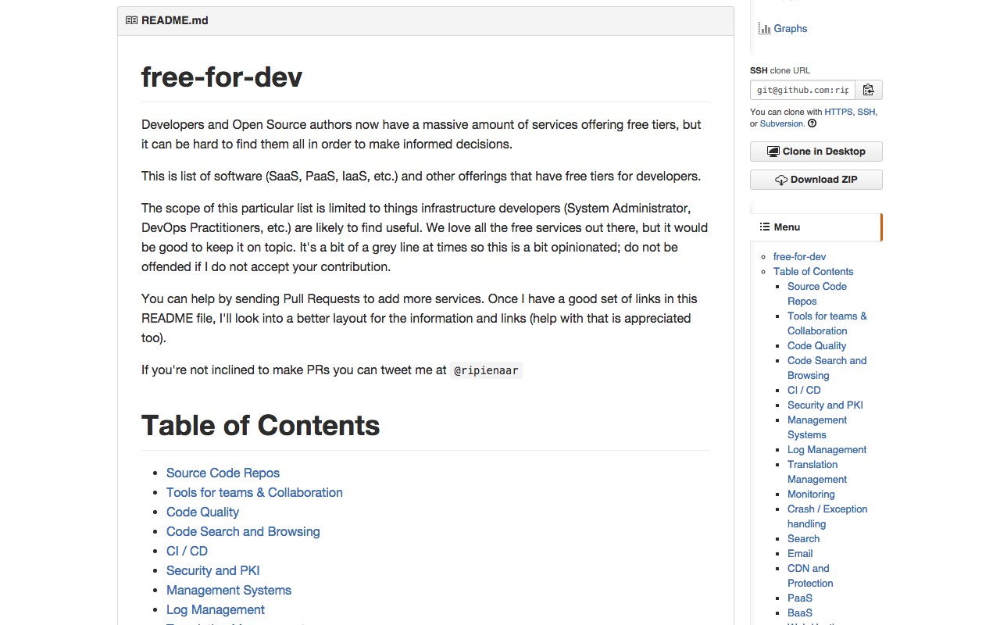

# GitHub Markdown Sidebar Menu

> Browser extension that adds a navigation menu to readme file in GitHub sidebar.

GitHub README documents don't always include a Table of Contents. Well-documented repos have longer documents that can be difficult to navigate. This extension will automagically generate and add a navigation menu with a table of contents in GitHub repo homepage sidebar.

Click on the three-bar icon at the top of any Markdown file to view the menu. Click on a link to scroll to that section of the document. That's it!

README example:

## Install

[Chrome WebStore](https://chrome.google.com/webstore/detail/github-markdown-sidebar-m/cjbnpllhpmicaacocjjfiickmbggdlkj)

### For Developers

You can also setup the dev version:

- from the CLI: git clone https://github.com/amowu/github-markdown-menu.git
- open the extensions page: chrome://extensions
- enable Developer mode
- click Load unpacked extension, selecting the chrome/app directory

## Permissions

In Chrome, this extension requests the following permissions:
- Read and change your data on github.com
> This extension is scoped and enabled only when accessing https://github.com/\*. This extension looks for Markdown headers, generates a navigation menu and adds it to Markdown views on GitHub.

- Read your browsing history
> For this extension to work across page navigations within github.com, permissions are necessary to use chrome.webNavigation.onHistoryStateUpdated. This lets the extension hook into page navigations and trigger without full page refreshes.

## Contribute

On-going development & open issues are tracked using Waffle: 

### Guidelines

- in the chrome directory, run npm install
- run grunt debug to run tests
- setup [EditorConfig](http://editorconfig.org/) in your preferred editor to maintain file consistency
- make sure there are no JSHint warnings or errors

### Dependencies

The Chrome extension was generated using [Yeoman](http://yeoman.io) and the [Chrome Extension generator](https://github.com/yeoman/generator-chrome-extension). [Grunt](http://gruntjs.com/) is used for building and packaging the extension. There are no runtime dependencies.

## About

Thanks for [Will Klein](https://github.com/willklein)'s open source project [GitHub Markdown Menu](https://github.com/willklein/github-markdown-menu).

## License

[MIT](http://mit-license.org/) © [Will Klein](http://willkle.in), [Amo Wu](http://amowu.com)
